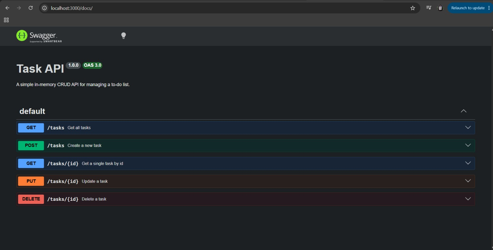

# Task API

A simple CRUD API for managing a to-do list, built with Node.js and Express, backed by a SQLite database.

## What this is

This API lets you create, read, update, and delete tasks. Data is stored persistently in a SQLite
database (`tasks.db`) — it survives server restarts, unlike the in-memory version from the previous
version of this project.

## Why SQLite

SQLite was chosen because it needs no separate database server — the entire database is a single file
(`tasks.db`) that gets created automatically the first time the app runs. That makes it perfect for a
small project like this: zero setup, zero configuration, and the data still survives restarts.

## Where the database lives

The database file is `tasks.db`, created automatically in the project root the first time you run the
server. It's git-ignored, so each fresh clone starts with a brand new, empty database that seeds itself
with 3 example tasks on first run.

## How to run it

\`\`\`bash
git clone https://github.com/HussainAli7858/crud-task-api.git
cd crud-task-api
npm install
node --experimental-sqlite index.js
\`\`\`

Server runs at `http://localhost:3000`. The database and its table are created automatically, and 3
example tasks are seeded on first run only.

## Endpoints

| Method | Path       | Description       |
| ------ | ---------- | ----------------- |
| GET    | /          | API info          |
| GET    | /health    | Health check      |
| GET    | /tasks     | List all tasks    |
| GET    | /tasks/:id | Get a single task |
| POST   | /tasks     | Create a new task |
| PUT    | /tasks/:id | Update a task     |
| DELETE | /tasks/:id | Delete a task     |

## Example request

\`\`\`bash
curl -i -X POST http://localhost:3000/tasks -H "Content-Type: application/json" -d '{"title":"Buy milk"}'
\`\`\`

Example response:

\`\`\`
HTTP/1.1 201 Created
X-Powered-By: Express
Content-Type: application/json; charset=utf-8
Content-Length: 40

{"id":4,"title":"Buy milk","done":0}
\`\`\`

## Swagger UI

Interactive API docs available at `http://localhost:3000/docs` once the server is running.

## Database

Tasks are stored in a SQLite database (`tasks.db`), queried directly with SQL — every CRUD operation
(GET, POST, PUT, DELETE) runs a parameterized SQL query against it (`SELECT`, `INSERT`, `UPDATE`,
`DELETE`), rather than working with an in-memory array.

### Example SQL query

\`\`\`sql
SELECT COUNT(\*) FROM tasks;
\`\`\`

Ran this in DB Browser for SQLite and got 3, confirming the seed data loaded correctly on a fresh database.

## Notes

Unlike the in-memory version, data now survives a server restart — this was tested directly by creating
tasks, restarting the server, and confirming they were still present via `GET /tasks`.
